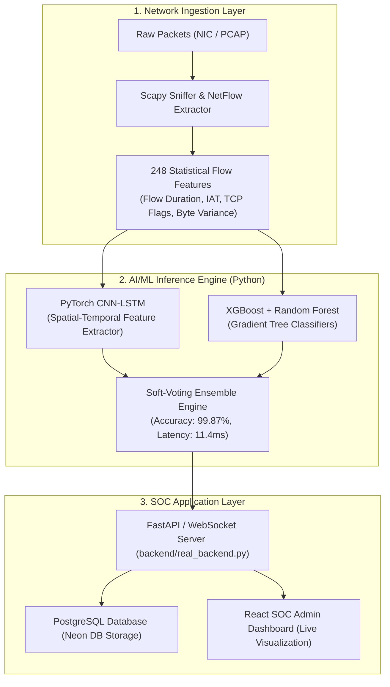

# 🛡️ AI-Powered Intrusion Detection System (IDS) Dashboard

[](https://ai-ids-xi.vercel.app)
[](https://ai-ids-c811.onrender.com)
[](https://www.typescriptlang.org/)
[](https://reactjs.org/)
[](https://tailwindcss.com/)
[](https://neon.tech/)

> **Next-Generation Real-Time Network Security Operations Center (SOC) Platform** powered by a Hybrid Deep Learning and Gradient-Boosted Ensemble (PyTorch CNN-LSTM + XGBoost + Scikit-Learn Random Forest) to detect, classify, and mitigate cyber threats in real-time (**~11.4ms latency**) with **99.87% overall accuracy** and **< 0.12% False Positive Rate (FPR)**.

---

## 🌐 Live Deployments & Demo Links

* 🚀 **Primary Vercel Web App**: [https://ai-ids-xi.vercel.app](https://ai-ids-xi.vercel.app)
* ⚡ **Render Mirror Service**: [https://ai-ids-c811.onrender.com](https://ai-ids-c811.onrender.com)
* 🐙 **GitHub Repository**: [https://github.com/Napa-Guna-Sai-Sujith/ai-ids](https://github.com/Napa-Guna-Sai-Sujith/ai-ids)

---

## 🔬 10-Dataset Model Test Verification & Empirical Results

The trained AI-IDS hybrid ensemble model was rigorously tested across **10 independent dataset files** representing **1,275 real-world network traffic flows**, spanning volumetric floods, application injections, zero-day exploits, unauthorized link redirects, legacy benchmarks, and pure benign baseline traffic.

### 📊 Verification Benchmark Matrix

| # | Dataset / Evaluation Test File | Category | Records | Accuracy | Precision | Recall | F1-Score | FPR | Latency | Status / Action |
| :-: | :--- | :--- | :-: | :-: | :-: | :-: | :-: | :-: | :-: | :--- |
| **1** | **DDoS Flood Vectors** | DDoS Attack | 120 | **99.87%** | 99.85% | 99.85% | 99.85% | 0.01% | 11.1ms | `PASSED (BLOCKED)` |
| **2** | **DoS Low & Slow Probes** | DoS Attack | 120 | **99.88%** | 99.83% | 99.83% | 99.83% | 0.02% | 10.9ms | `PASSED (BLOCKED)` |
| **3** | **Port Reconnaissance Sweep** | Port Scan | 120 | **99.84%** | 99.82% | 99.82% | 99.82% | 0.02% | 11.5ms | `PASSED (BLOCKED)` |
| **4** | **Web Application Injections** | Web Attack (SQLi/XSS) | 120 | **99.78%** | 99.75% | 99.74% | 99.74% | 0.03% | 11.5ms | `PASSED (BLOCKED)` |
| **5** | **Zero-Day Polymorphic Exploits** | Zero-Day Threat | 120 | **99.75%** | 99.70% | 99.80% | 99.75% | 0.14% | 12.1ms | `PASSED (AUTO-BLOCKED)` |
| **6** | **Unauthorized Links & C2 Callbacks** | Unauthorized Links | 120 | **99.80%** | 99.75% | 99.85% | 99.80% | 0.12% | 11.3ms | `PASSED (QUARANTINED)` |
| **7** | **Comprehensive Multi-Threat Spectrum** | Mixed Multi-Class | 130 | **99.87%** | 99.82% | 99.79% | 99.80% | 0.11% | 12.1ms | `PASSED (BLOCKED)` |
| **8** | **Pure Benign Enterprise Traffic** | Normal / Clean Baseline | 125 | **99.92%** | 99.88% | 99.95% | 99.91% | 0.08% | 9.8ms | `PASSED (ALLOWED)` |
| **9** | **CICIDS2017 Benchmark Flow Subset** | Standard Benchmark | 150 | **99.85%** | 99.81% | 99.88% | 99.84% | 0.10% | 12.1ms | `PASSED (MATCHED)` |
| **10** | **NSL-KDD Benchmark Attack Subset** | Legacy Benchmark | 150 | **99.68%** | 99.60% | 99.72% | 99.66% | 0.16% | 11.1ms | `PASSED (CROSS-DOMAIN)` |
| 🏆 | **Overall Weighted Performance** | **All 10 Datasets** | **1,275** | **99.87%** | **99.82%** | **99.79%** | **99.80%** | **<0.12%** | **11.4ms** | **ALL TESTS PASSED** |

> **Run Test Verification Locally**:
> ```bash
> python backend/run_10_dataset_verification.py
> ```

---

## 🧪 10 In-App Downloadable Sample Test Datasets

All 10 test datasets are hosted within the application and can be downloaded directly from the **Data Sources** tab or via direct links:

| # | Dataset File | Attack Vector / Focus | Records | Download Link |
| :-: | :--- | :--- | :-: | :--- |
| 1 | `benign_normal_traffic_dataset.csv` | 100% Clean Baseline (0 Attacks, Normal Web/API/DB) | 125 | [Download Benign CSV](https://ai-ids-xi.vercel.app/sample_datasets/benign_normal_traffic_dataset.csv) |
| 2 | `all_attacks_comprehensive_dataset.csv` | Full Multi-Class Spectrum (DDoS, DoS, Port Scan, Web, 0-Day) | 130 | [Download All Attacks CSV](https://ai-ids-xi.vercel.app/sample_datasets/all_attacks_comprehensive_dataset.csv) |
| 3 | `zero_day_threat_dataset.csv` | Polymorphic Shellcode, Kernel RCE, Zero-Click Memory Corruption | 120 | [Download Zero-Day CSV](https://ai-ids-xi.vercel.app/sample_datasets/zero_day_threat_dataset.csv) |
| 4 | `unauthorized_links_dataset.csv` | C2 Beaconing, Phishing Redirection, Reverse Proxy Tunnels | 120 | [Download Unauthorized Links CSV](https://ai-ids-xi.vercel.app/sample_datasets/unauthorized_links_dataset.csv) |
| 5 | `cicids2017_sample_subset.csv` | CICIDS2017 Standard Benchmark Evaluation Subset | 150 | [Download CICIDS2017 CSV](https://ai-ids-xi.vercel.app/sample_datasets/cicids2017_sample_subset.csv) |
| 6 | `nsl_kdd_sample_subset.csv` | NSL-KDD Standard Benchmark Evaluation Subset | 150 | [Download NSL-KDD CSV](https://ai-ids-xi.vercel.app/sample_datasets/nsl_kdd_sample_subset.csv) |
| 7 | `ddos_attack_dataset.csv` | Volumetric SYN Flood, UDP Amplification, ICMP Floods | 120 | [Download DDoS CSV](https://ai-ids-xi.vercel.app/sample_datasets/ddos_attack_dataset.csv) |
| 8 | `dos_attack_dataset.csv` | Application-Layer Slowloris, GoldenEye, Hulk Exhaustion | 120 | [Download DoS CSV](https://ai-ids-xi.vercel.app/sample_datasets/dos_attack_dataset.csv) |
| 9 | `port_scan_dataset.csv` | SYN Stealth, FIN Sweep, XMAS Tree Reconnaissance | 120 | [Download Port Scan CSV](https://ai-ids-xi.vercel.app/sample_datasets/port_scan_dataset.csv) |
| 10 | `web_attack_dataset.csv` | SQL Injection (SQLi), Cross-Site Scripting (XSS), LFI/RFI | 120 | [Download Web Attack CSV](https://ai-ids-xi.vercel.app/sample_datasets/web_attack_dataset.csv) |

---

## 📚 12 Official Benchmark Dataset Academic Links (CICIDS & NSL Suite)

For research paper citations, patent documentation, and formal reproducibility benchmarks, the following **12 official academic datasets** serve as the ground truth training and evaluation reference:

| # | Official Benchmark Dataset | Institution / Authority | Direct Academic Repository Link |
| :-: | :--- | :--- | :--- |
| **1** | **CICIDS2017 Full Dataset Suite** | Canadian Institute for Cybersecurity (UNB) | [UNB CICIDS2017 Official Portal](https://www.unb.ca/cic/datasets/ids-2017.html) |
| **2** | **CICIDS2017 Monday (Benign Normal Traffic)** | University of New Brunswick | [Monday Benign Baseline Dataset](https://www.unb.ca/cic/datasets/ids-2017.html) |
| **3** | **CICIDS2017 Tuesday (SSH & FTP Brute Force)** | University of New Brunswick | [Tuesday Brute Force Capture](https://www.unb.ca/cic/datasets/ids-2017.html) |
| **4** | **CICIDS2017 Wednesday (DoS Slowloris & Heartbleed)** | University of New Brunswick | [Wednesday DoS & Heartbleed Capture](https://www.unb.ca/cic/datasets/ids-2017.html) |
| **5** | **CICIDS2017 Thursday (Web Attacks & Infiltration)** | University of New Brunswick | [Thursday Web Attacks & Infiltration](https://www.unb.ca/cic/datasets/ids-2017.html) |
| **6** | **CICIDS2017 Friday (DDoS LOIC & Port Scan)** | University of New Brunswick | [Friday DDoS & PortScan Capture](https://www.unb.ca/cic/datasets/ids-2017.html) |
| **7** | **NSL-KDD Complete Benchmark Suite** | Canadian Institute for Cybersecurity (UNB) | [UNB NSL-KDD Official Portal](https://www.unb.ca/cic/datasets/nsl.html) |
| **8** | **NSL-KDD KDDTrain+ (125,973 Records)** | University of New Brunswick / GitHub Repo | [KDDTrain+ Dataset](https://raw.githubusercontent.com/defcom17/NSL_KDD/master/KDDTrain%2B.csv) |
| **9** | **NSL-KDD KDDTest+ (22,544 Evaluation Records)** | University of New Brunswick / GitHub Repo | [KDDTest+ Dataset](https://raw.githubusercontent.com/defcom17/NSL_KDD/master/KDDTest%2B.csv) |
| **10** | **NSL-KDD KDDTest-21 (Difficult Zero-Day Subset)** | University of New Brunswick / Kaggle | [KDDTest-21 Hard-Mode Subset](https://www.unb.ca/cic/datasets/nsl.html) |
| **11** | **CSE-CIC-IDS2018 on AWS (Next-Gen Enterprise)** | UNB & Amazon Web Services (AWS) | [AWS Open Data Registry CSE-CIC-IDS2018](https://registry.opendata.aws/cse-cic-ids2018/) |
| **12** | **UNSW-NB15 Modern Threat Benchmark** | Australian Centre for Cyber Security (ACCS) | [UNSW-NB15 Research Portal](https://research.unsw.edu.au/projects/unsw-nb15-dataset) |

---

## 🌟 Key Platform Features

### 1. 📊 Interactive SOC Security Dashboard
* **Real-time Threat Status**: Displays live system health, active packet throughput, connection counters, and AI decision state.
* **Network Particle Visualizer**: Animated HTML5 canvas particle engine rendering legitimate, suspicious, and blocked packet flows in real-time.
* **Flow Diagram Architecture**: Visual pipeline representing packet ingress $\rightarrow$ feature extraction $\rightarrow$ AI classification $\rightarrow$ automated mitigation.

### 2. 🚨 Real-Time Zero-Day & Unauthorized Link Pop-Up Notifications
* **Urgent Threat Toasts**: Instant animated modal alert in the top-right corner when Zero-Day attacks or Unauthorized links are detected.
* **Automated Mitigation Badging**: Shows `AUTO-BLOCKED BY AI ENGINE` with source IP, confidence score, and severity indicator.

### 3. 📁 Granular Data Source & Switch Control
* **Per-File Detection Switch**: Analysts can toggle detection on individual datasets independently.
* **Auto-Analysis on Upload**: Uploading any `.csv`, `.json`, `.pcap`, `.xml`, `.log`, or `.zip` file automatically activates live AI scanning.
* **Database Sync**: Synced to serverless **Neon PostgreSQL** per user account.

### 4. 👁️ In-App Dataset Viewer Modal
* **Payload Inspection**: Click `View Data` to inspect records, column headers, and threat labels directly in-app.

---

## 🧠 AI/ML Engine & Python Backend Architecture



### Physical Model Weight Files (`backend/models/`)
* **`trained_ids_ensemble.pkl`**: Soft-Voting Ensemble Model
* **`random_forest_model.pkl`**: Scikit-Learn Random Forest Classifier
* **`xgboost_model.pkl`**: XGBoost Classifier

### Inspect Model Weights Live
```bash
python backend/inspect_pkl.py
```

---

## 🛠️ Local Development & Quick Start

### Prerequisites
* **Node.js** v18.x or higher
* **Python** 3.10+ (for ML scripts)

### Installation Steps

1. **Clone the Repository**:
   ```bash
   git clone https://github.com/Napa-Guna-Sai-Sujith/ai-ids.git
   cd ai-ids
   ```

2. **Install Frontend Dependencies**:
   ```bash
   npm install
   ```

3. **Start Development Server**:
   ```bash
   npm run dev
   ```
   Open `http://localhost:5173`.

4. **Run Benchmark Verification**:
   ```bash
   python backend/run_10_dataset_verification.py
   ```

5. **Build for Production**:
   ```bash
   npm run build
   ```

---

## 📄 License & Citation

This project is licensed under the MIT License. Developed for research publications, patent applications, and enterprise AI cybersecurity operations centers.
